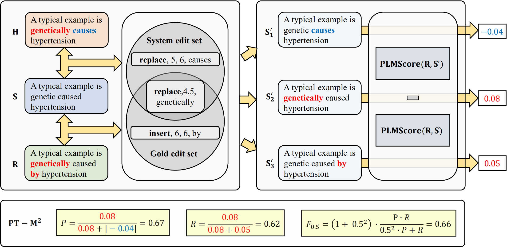

# PT-M2
This repository contains the source code for ["Revisiting Grammatical Error Correction 
Evaluation and Beyond"](), which experiments if recent pretrain-based (PT-based) metrics 
such as BERTScore and BARTScore are suitable for GEC evaluation task and proposes a novel 
PT-based GEC metric **PT-M2**, which uses to evaluate GEC system outputs with pretrained 
knowledge, measures whether the GEC system corrects more important errors.

## Overview
PT-M2 takes advantages of both PT-based metrics (e.g. BERTScore, BARTScore) and
edit-based metrics (e.g. M2, ERRANT). Without directly using PT-based metrics to
score hypothesis-reference sentence pairs, we use them at the edit level to compute 
a score for each edit. Experiments show that PT-M2 correlates better with human 
judgements on both sentence-level and corpus-level, and is competent to evaluate
high-performing GEC systems.


For an illustration, PT-M2 can be computed as 


If you find this repo useful, please cite:
```sh
@inproceedings{gong2022revisiting,
 author = {Gong, Peiyuan and Liu, Xuebo and Huang, Heyan and Zhang, Min},
 booktitle = {Proceedings of the 2022 Conference on Empirical Methods in Natural Language Processing},
 title = {Revisiting Grammatical Error Correction Evaluation and Beyond},
 url = {https://arxiv.org/abs/2211.01635}, 
 year = {2022}
}
```

## Installation

- Python version >= 3.6
- PyTorch version >= 1.0.0
- Transformers version >= 4.10.0
- errant >= 3.2.0

Install it from the source by:

```sh
git clone https://github.com/pygongnlp/PT-M2.git
cd PT-M2
```
<!--
## Download Dataset
You can download CoNLL14 evaluation dataset from 
[Google Driven](https://drive.google.com/file/d/1a5uFzHKLALg7geX09Qp4GUTUf6SWkFTj/view?usp=share_link),
and then unzip it in PT-M2/ -->

## Script

You can compute GEC system score based on this script, whether for M2, ERRANT or our PT-M2
```sh
python evaluate.py --base [m2|sentm2|errant|senterrant] \
                   --scorer [self|bertscore|bartscore] \
                   --model_type <model_type> \
                   --source <source_file> \
                   --hypothesis <hypothesis_file> \
                   --reference <reference_file> \
                   --output <output_file> 
```
where
```sh
OPTIONS
     --base    - GEC base metric, m2 or errant, corpus-level or sentence-level
     --scorer  - edit scorer, bertscore, bartscore or without scorer (self) 
     --model_type  - PT-based model, such as bert-base-uncased (bertscore)
     --beta    - F_beta, default = 0.5
     --source    - source file path
     --hypothesis    - hypothesis file path
     --reference    - reference file path
     --output    - output file path
```
We recommended PT-M2 configuration is `base=sentm2`, `scorer=bertscore` and `model_type=bert-base-uncased`

## Example
We give an example (data/) to show how to compute PT-M2

### Data preprocess
- Source, hypothesis, reference are used as inputs, multi reference files are supported. For example:
```sh
/PT-M2
  /data
      /reference
        ref0
        ref1 
      source
      hypothesis
      reference.m2 (m2score)
```
- For M2, exclude above three files, we also need a gold m2 file (reference.m2) annotated by human. (How to extract edits actually can be found in [edit_creator](https://github.com/nusnlp/m2scorer/blob/master/scripts/edit_creator.py))
- For ERRANT, we should extract source-hypothesis edits (m2_file) and source-references edits (m2_file) before compute the system score
```sh
# First we extract source-reference edits based on multi-references
errant_parallel -orig data/source -cor data/reference/ref0 data/reference/ref1 -out data/reference.m2
# Second we extracct source-hypothesis edits
errant_parallel -orig data/source -cor data/hypothesis -out data/hypothesis.m2
```
### Compute score
```sh
python evaluate.py --source data/source --reference data/reference --hypothesis data/hypothesis --output data/output --base sentm2 --scorer bertscore --model_type bert-base-uncased
```
### Results
```sh
base=sentm2, scorer=bertscore, model_type=bert-base-uncased, score=0.3756
```
<!--## Correlation Experiments

### 1. Compute system score
You can compute each system score based on this script, whether for M2, ERRANT or our PT-M2
```sh
python evaluate.py --base [m2|sentm2|errant|senterrant] \
                   --scorer [self|bertscore|bartscore] \
                   --model_type <model_type>
                   --output_file <output_file> 
```
where
```sh
OPTIONS
     -b  --base    - GEC base metric, m2 or errant, corpus-level or sentence-level
     -s  --scorer  - edit scorer, bertscore, bartscore or without scorer (self) 
     -m  --model_type  - PT-based model, such as bert-base-uncased (bertscore)
     -o  --output_file    - output score of each gec system
     --beta    - F_beta, default = 0.5
```
Oral
* M2\
``python evaluate.py --base m2 --scorer self --output_file m2``
* SentM2\
``python evaluate.py --base sentm2 --scorer self --output_file sentm2``
* ERRANT\
``python evaluate.py --base errant --scorer self --output_file errant``
* SentM2\
``python evaluate.py --base senterrant --scorer self --output_file senterrant``

### BERTScore Edit Scorer
* M2\
``python evaluate.py --base m2 --scorer bertscore --model_type bert-base-uncased --output_file bertscore_bertbase_m2``
* SentM2\
``python evaluate.py --base sentm2 --scorer bertscore --model_type bert-base-uncased --output_file bertscore_bertbase_sentm2``
* ERRANT\
``python evaluate.py --base errant --scorer bertscore --model_type bert-base-uncased --output_file bertscore_bertbase_errant``
* SentM2\
``python evaluate.py --base senterrant --scorer bertscore --model_type bert-base-uncased --output_file bertscore_bertbase_senterrant``

**Note**    all the PT models that BERTScore supports can be used in our metric, and output_file_name can be defined by yourself

### BARTScore Edit Scorer
* M2\
``python evaluate.py --base m2 --scorer bartscore --model_type bart-base --output_file bartscore_bartbase_m2``
* SentM2\
``python evaluate.py --base sentm2 --scorer bartscore --model_type bart-base --output_file bartscore_bartbase_sentm2``
* ERRANT\
``python evaluate.py --base errant --scorer bartscore --model_type bart-base --output_file bartscore_bartbase_errant``
* SentM2\
``python evaluate.py --base senterrant --scorer bartscore --model_type bart-base --output_file bartscore_bartbase_senterrant``

**Note**    all the PT models that PT-based metrics support can be used in PT-M2, and output_file_name can be defined by yourself

### 2. Compute correlation

* gzip ranking files you generate \
```sh
cd .\gecmetrics
gzip .\scores\conll14\system_scores_metrics\*.txt
```
* system-level evaluation\
```sh
bash run.sh
```
-->

## Contact
If you have any questions related to the code or the paper, feel free to email Peiyuan Gong (pygongnlp@gmail.com). If you encounter any problems when using the code, or want to report a bug, you can open an issue. Please try to specify the problem with details so we can help you better and quicker!
